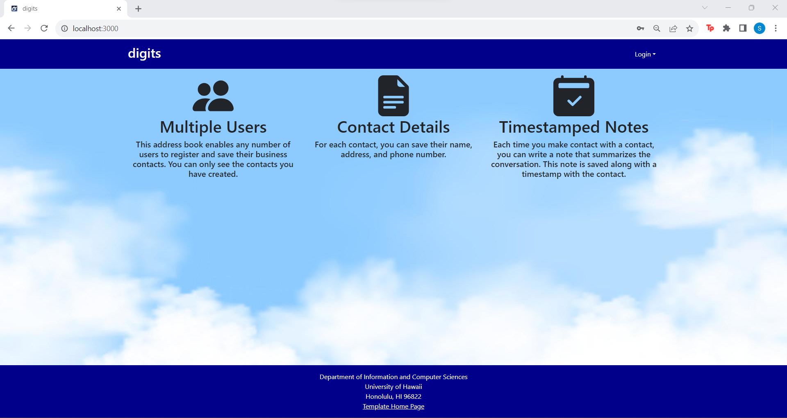
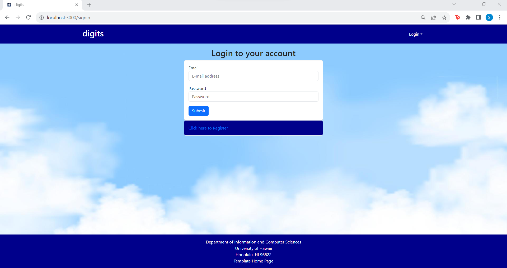
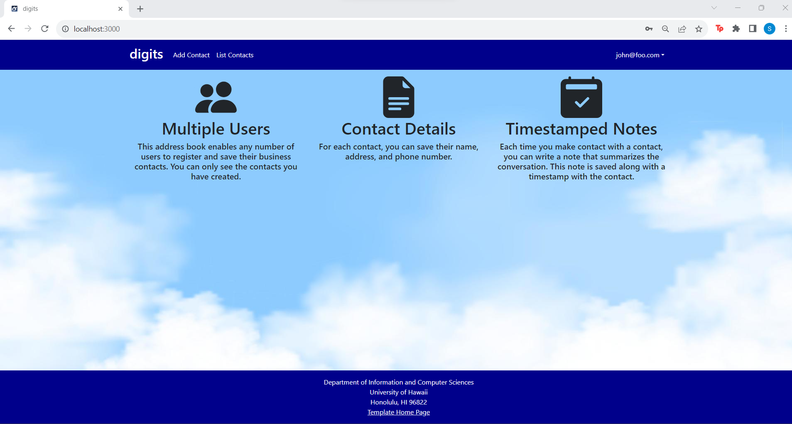
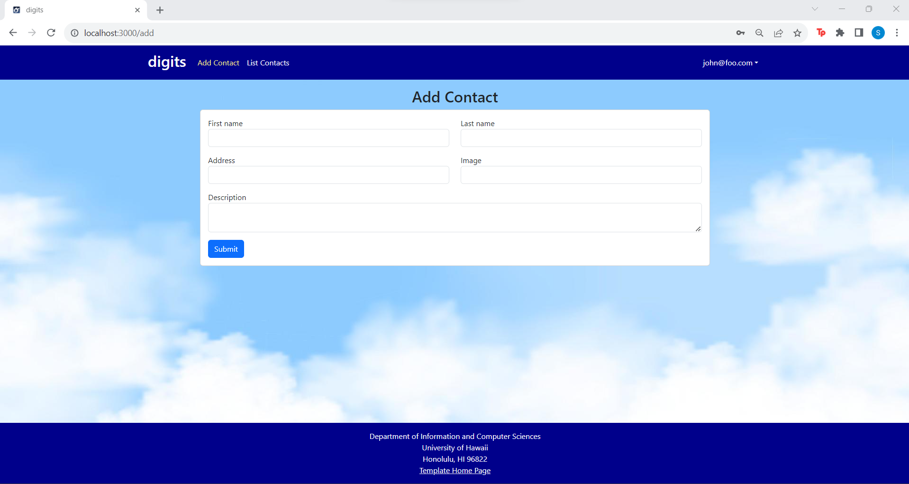
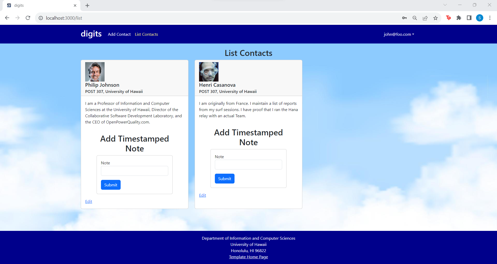
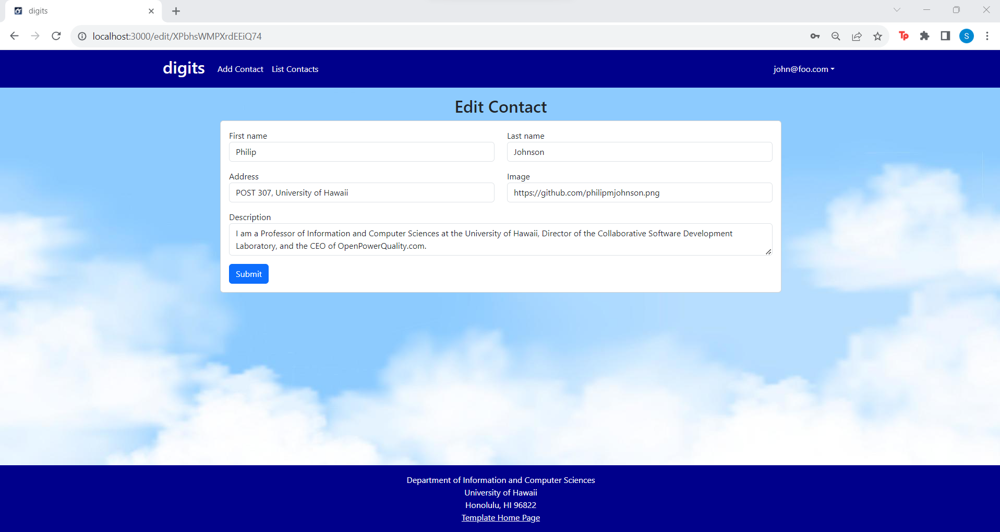
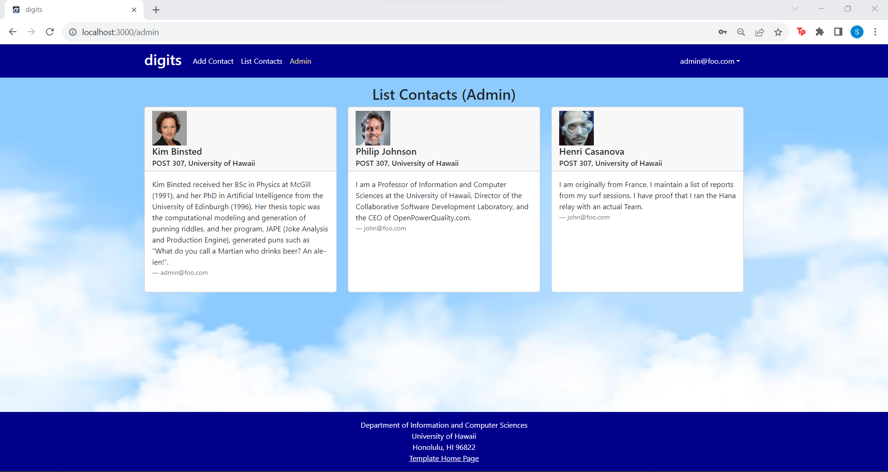

Digits is an application that allows users to: 

  * Create an account
  * Add contacts and edit them
  * View a list of contacts and add timestamped notes

## Installation

First, [install Meteor](https://www.meteor.com/install).

Second, request permission from the author of the Digits repository to access the repo.

Third, go to your newly created repository, and click the "Clone or download" button to download your new GitHub repo to your local file system.  Using [GitHub Desktop](https://desktop.github.com/) is a great choice if you use MacOS or Windows.

Fourth, cd into the app/ directory of your local copy of the repo, and install third party libraries with:

```
$ meteor npm install
```

## Running the system

Once the libraries are installed, you can run the application by invoking the "start" script in the [package.json file](https://github.com/ics-software-engineering/meteor-application-template-react/blob/master/app/package.json):

```
$ meteor npm run start
```

The first time you run the app, it will create some default users and data. Here is a sample output:

```
 meteor npm run start 
                             
> meteor-application-template-react@ start C:\Users\Silvia\Documents\ICS314\digits\app
> meteor --no-release-check --exclude-archs web.browser.legacy,web.cordova --settings ../config/settings.development.json

[[[[[ C:\Users\Silvia\Documents\ICS314\digits\app ]]]]]

=> Started proxy.
=> Started HMR server.
=> Started MongoDB.                           
I20231107-17:54:10.076(-10)? Creating the default user(s)
I20231107-17:54:10.102(-10)?   Creating user admin@foo.com.
I20231107-17:54:10.301(-10)?   Creating user john@foo.com.
I20231107-17:54:10.496(-10)? Creating default contacts.
I20231107-17:54:10.498(-10)?   Adding: Johnson (john@foo.com)
I20231107-17:54:10.540(-10)?   Adding: Casanova (john@foo.com)
I20231107-17:54:10.543(-10)?   Adding: Binsted (admin@foo.com)
=> Started your app.

=> App running at: http://localhost:3000/
```

### Viewing the running app

If all goes well, the template application will appear at [http://localhost:3000](http://localhost:3000).  You can login using the credentials in [settings.development.json](https://github.com/ics-software-engineering/meteor-application-template-react/blob/main/config/settings.development.json), or else register a new account.

### ESLint

You can verify that the code obeys coding standards by running ESLint over the code in the imports/ directory with:

```
meteor npm run lint
```

## User Interface Walkthrough

#### Landing page

When you retrieve the app at http://localhost:3000, this is what should be displayed:


The next step is to use the Login menu to either Login to an existing account or register a new account.

#### Login page

Clicking on the Sign In menu item displays this page:



#### Register page

To create a new account, the user will need to click on Sign up menu item, which will display this page:


#### Landing (after Login) page, non-Admin user

Once you log in (either to an existing account or by creating a new one), the navbar changes as follows:



You can now add new contacts and save them. Note you cannot see any Contact created by other users.

#### Add Contact page

After logging in, here is the page that allows you to add a new contact:



#### List Contact page

After logging in, here is the page that allows you to list all the contacts you have created:



To "Edit" a contact, you can click on the bottom link of the contact to go to the Edit Contact page, shown next.

#### Edit Contact page

After clicking on the "Edit" link associated with a contact, the following page is displayed, which allows the user to change the contact's information and save it:



#### Landing (after Login), Admin user

You can define an "admin" user in the settings.json file. This user, after logging in, gets a special entry in the navbar:


#### Admin page (list all users contact)

A feature that comes with signing in as an admin is being able to see the "Admin" page, which lists all of the contacts from other users:



Note that non-admin users cannot get to this page, even if they type in the URL by hand.

